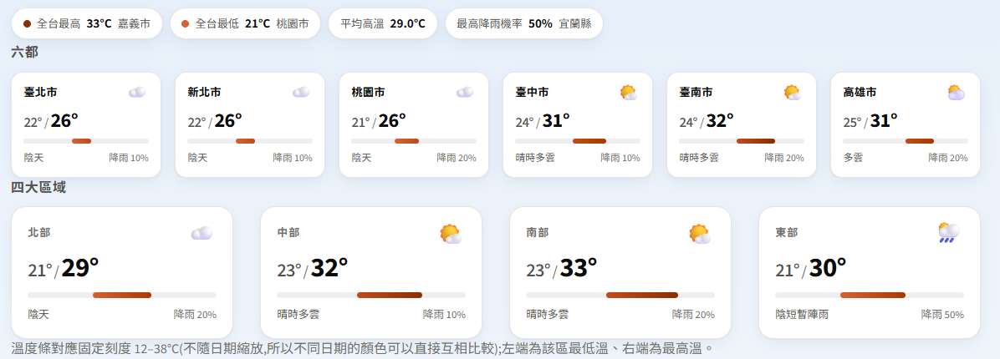
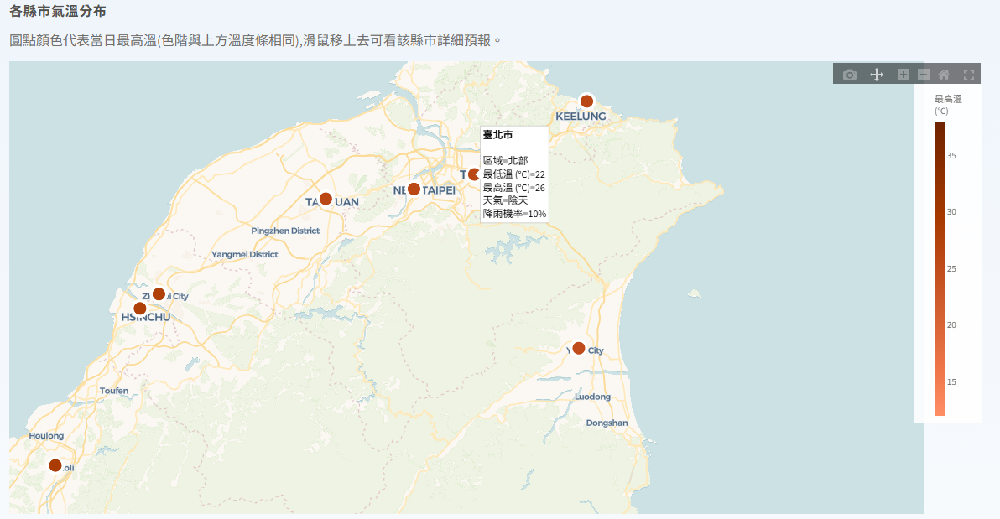
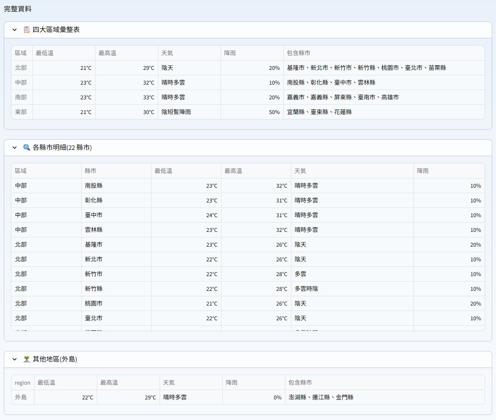

# 🌤️ HW1-Taiwan-Weather — 台灣天氣預報網頁

用 **Python + 中央氣象署(CWA)開放資料 API + SQLite + Streamlit** 做的台灣四大區域一週天氣預報網頁。
資料每次更新都會寫進本機 SQLite,網頁再從資料庫讀取並用表格與互動地圖呈現。


---

## 📌 專案簡介與功能

| 功能 | 說明 |
|---|---|
| 抓取真實氣象資料 | 呼叫 CWA 開放資料 API `F-D0047-091`(臺灣各縣市未來一週天氣預報) |
| 縣市 → 四大區域 | 22 縣市自動歸類為 **北部、中部、南部、東部**(離島另列) |
| 每日彙整 | 原始資料是 12 小時區間,程式會依日期彙整成每天的最低溫 / 最高溫 |
| 存入 SQLite | `UNIQUE(city, date)` + upsert,重複抓取不會產生重複資料 |
| 日期選擇器 | 只列出今天(含)以後、而且資料庫中確實有預報的日期,預設停在今天 |
| 依當天日期自動調整 | 開頁時若資料庫沒有今天的預報、或最後一次抓取不是今天,會自動呼叫一次 API 更新 |
| 四大區域卡片 | 一排四張白色圓角卡片:天氣 emoji、大字溫度、固定刻度的溫度區間條、降雨機率 |
| 六都字卡 | 臺北、新北、桃園、臺中、臺南、高雄六張小卡(3×2),放在最上方 |
| 全寬互動地圖 | plotly 彩色底圖(carto-voyager)標出 22 縣市,圓點顏色代表當日最高溫,滑鼠可看詳細預報 |
| 完整表格 | 區域彙整表 + 22 縣市明細兩張表,刻意分成不同層級不重複,收在展開區 |
| 一鍵更新 | 側邊欄「🔄 重新抓取最新資料」按鈕 |
| 完整錯誤處理 | API Key 未設定、API 失敗、資料格式改變、資料庫空白都有明確提示 |
| 單元測試 | 88 個 pytest 測試,解析與資料庫測試**完全不呼叫真實 API** |

---

## 🧰 使用的工具

| 工具 | 用途 |
|---|---|
| **Claude Code** | AI Coding 夥伴:規劃、撰寫程式、邊做邊測試、Git 版本控管 |
| **Python 3.9+** | 主要開發語言 |
| **CWA Open Data API** | 中央氣象署開放資料平臺,提供真實天氣預報 |
| **requests** | 呼叫 API |
| **python-dotenv** | 從 `.env` 讀取 API 授權碼,不讓金鑰進入程式碼 |
| **SQLite** | 本機資料庫(Python 內建 `sqlite3`,免安裝) |
| **pandas** | 資料整理與區域彙整 |
| **Streamlit** | 網頁介面 |
| **plotly** | 互動式氣溫地圖 |
| **Streamlit 主題 + CSS** | 清爽淡藍卡片版面(`.streamlit/config.toml` 與 `src/theme.py`) |
| **pytest** | 單元測試 |
| **Git / GitHub** | 版本控管與作品發布 |

---

## 📁 專案結構

```
HW1-Taiwan-Weather/
├── .venv/                      # 虛擬環境(已被 .gitignore 排除)
├── .streamlit/
│   └── config.toml             # 淺色主題設定
├── data/
│   ├── weather.db              # SQLite 資料庫(已排除,執行後自動產生)
│   └── raw/                    # 原始 JSON 備份(已排除)
├── docs/images/                # 放你自己的畫面截圖
├── src/
│   ├── config.py               # 路徑、資料集代碼、API Key 讀取
│   ├── regions.py              # 縣市 → 四大區域對應表
│   ├── theme.py                # 溫度色階、天氣 emoji、配色常數
│   ├── fetch.py                # 呼叫 CWA API
│   ├── parse.py                # JSON 解析(純函式,好測試)
│   ├── db.py                   # SQLite 建表、upsert、查詢
│   ├── pipeline.py             # 抓取 → 解析 → 寫入 的完整流程
│   └── probe_api.py            # 資料集探測腳本(分析 JSON 結構用)
├── tests/
│   ├── fixtures/sample_forecast.json   # 測試用假資料
│   ├── test_parse.py           # 解析測試(22 項)
│   ├── test_db.py              # 資料庫測試(17 項)
│   ├── test_fetch.py           # API 錯誤處理測試(11 項)
│   ├── test_config.py          # 金鑰讀取測試(5 項)
│   ├── test_regions.py         # 區域對應測試(8 項)
│   ├── test_app.py             # 日期過濾與自動更新判斷測試(12 項)
│   └── test_theme.py           # 色階與 emoji 測試(13 項)
├── app.py                      # Streamlit 主程式
├── requirements.txt
├── pytest.ini
├── .gitignore                  # 排除 .env、.venv、__pycache__、*.db
├── .env.example                # 範例設定檔(可安全上傳)
├── .env                        # 你的真實金鑰(絕對不會被 commit)
└── README.md
```

---

## 🚀 安裝與執行步驟

### 1. 取得專案

```bash
git clone https://github.com/<your-username>/HW1-Taiwan-Weather.git
cd HW1-Taiwan-Weather
```

### 2. 申請 CWA API 授權碼(免費)

1. 到 **中央氣象署開放資料平臺** <https://opendata.cwa.gov.tw/> 點右上角「登入/註冊」。
2. 註冊會員並完成 email 驗證。
3. 登入後進入 **「取得授權碼」** 頁面:<https://opendata.cwa.gov.tw/user/authkey>
4. 點「取得授權碼」,會拿到一串 `CWA-` 開頭的字串,這就是你的 API Key。

### 3. 建立 `.env`

```bash
cp .env.example .env
```

用編輯器打開 `.env`,把 `your_key_here` 換成你剛剛申請到的授權碼:

```env
CWA_API_KEY=CWA-XXXXXXXX-XXXX-XXXX-XXXX-XXXXXXXXXXXX
```

> ⚠️ `.env` 已被 `.gitignore` 排除,**不會也不該被 commit 到 GitHub**。
> 要分享設定格式時請用 `.env.example`。

### 4. 建立虛擬環境並安裝套件

```bash
python3 -m venv .venv
source .venv/bin/activate          # Windows 用 .venv\Scripts\activate
pip install -r requirements.txt
```

### 5. 抓第一份資料

```bash
python -m src.pipeline
```

成功會看到類似輸出:

```
=== 更新成功 ===
資料集    : F-D0047-091
寫入列數  : 154
縣市數    : 22
日期範圍  : 2026-09-30 ~ 2026-10-06(共 7 天)
```

> 這一步可以跳過 —— 直接開網頁後點左側的「🔄 重新抓取最新資料」按鈕效果一樣。

### 6. 啟動網頁

```bash
streamlit run app.py
```

瀏覽器打開 <http://localhost:8501> 就看得到畫面了。

---

## 🖼️ 畫面截圖

> 請把你自己的截圖放到 `docs/images/` 後,取消下面的註解。

<!--
### 首頁 — 區域氣溫表格與指標


### 互動地圖


### 各縣市明細

-->

_(截圖位置,待補)_

---

## 🗂️ 資料集選擇說明

作業建議評估兩個候選資料集。實際呼叫 API 並用 `python -m src.probe_api` 印出 JSON 結構後,結論如下:

| 資料集 | 內容 | 是否採用 |
|---|---|---|
| `F-C0032-001` | 今明 36 小時天氣預報,22 縣市,每縣市只有 **3 個時段** | ❌ 只有今明兩天,日期選擇器幾乎沒東西可選 |
| `F-D0047-091` | 各縣市未來一週天氣預報,22 縣市,每縣市 **14 個 12 小時區間** | ✅ **採用** |

選 `F-D0047-091` 的三個理由:

1. 提供 **7 天** 資料,日期選擇器才有意義。
2. 直接包含 `最高溫度`、`最低溫度`、`天氣現象`、`12小時降雨機率` 四個要素。
3. 每個縣市附帶 **經緯度**(`Latitude` / `Longitude`),地圖不用自己硬寫座標。

### 使用到的 JSON 欄位路徑

```
records
└── Locations[0]
    └── Location[]                      # 22 個縣市
        ├── LocationName                # 縣市名稱,例如「臺北市」
        ├── Latitude / Longitude        # 經緯度 → 地圖用
        └── WeatherElement[]
            ├── ElementName: "最高溫度"        → Time[].ElementValue[0].MaxTemperature
            ├── ElementName: "最低溫度"        → Time[].ElementValue[0].MinTemperature
            ├── ElementName: "天氣現象"        → Time[].ElementValue[0].Weather
            └── ElementName: "12小時降雨機率"  → Time[].ElementValue[0].ProbabilityOfPrecipitation
```

每個 `Time[]` 是一個 12 小時區間(白天 06–18、夜間 18–翌日 06)。
程式依 `StartTime` 的日期分組後:

- **最低溫** = 當日各區間 `MinTemperature` 的 **最小值**
- **最高溫** = 當日各區間 `MaxTemperature` 的 **最大值**
- **天氣現象** = 優先取白天時段
- **降雨機率** = 當日各區間的 **最大值**

---

## 🗺️ 縣市 → 四大區域對應表

| 區域 | 縣市 |
|---|---|
| **北部** | 臺北市、新北市、基隆市、桃園市、新竹市、新竹縣、苗栗縣 |
| **中部** | 臺中市、彰化縣、南投縣、雲林縣 |
| **南部** | 嘉義市、嘉義縣、臺南市、高雄市、屏東縣 |
| **東部** | 宜蘭縣、花蓮縣、臺東縣 |
| _外島_ | 澎湖縣、金門縣、連江縣(不列入四大區域主表,另外顯示) |

> 氣象署原本把東岸細分成東北部(宜蘭)、東部(花蓮)、東南部(臺東),
> 本專案把三者合併成單一的「東部」,畫面上就是四張卡片。

區域的最低溫取該區所有縣市的最小值、最高溫取最大值。
程式也會把民間常用的「台」自動正規化成官方的「臺」,兩種寫法都查得到。

---

## 🎨 視覺設計說明

介面是**清爽淡藍卡片風**:一排四張白色圓角卡片 + 全寬互動地圖。配色不是憑感覺挑的:

- **溫度是「量值」,所以用單一色相的 sequential 色階,不用彩虹色。**
  色相固定在 OKLCH H≈40.6°(橘),只改亮度,由淺到深代表低溫到高溫。
- **色階刻度固定在 12–38°C,不隨當日資料縮放。**
  否則同一個顏色在不同日期會代表不同溫度,無法互相比較。
- **文字一律用中性色,不用色階顏色上色。**
  顏色只出現在「溫度條」與地圖圓點這兩個標記上,數字本身維持白色/灰色。
- **所有顏色都經過對比度實測**(而不是目測):
  主要文字對白卡片 19.68:1、次要文字 7.94:1、輔助文字 5.10:1(小字門檻 4.5:1),
  色階最淺階對白卡片 2.26:1;單一色相、亮度單調、相鄰階差 ΔL ≥ 0.06 四項檢查全過。
- **色彩之外一定有第二種讀法**:每張卡片都直接寫出溫度數字,
  展開區還有完整的表格,不讓資訊只靠顏色傳達。
- **地圖圓點下面疊了一層白色底環**:plotly 的 `scattermap` 不支援 marker 外框,
  所以用兩層 trace 做出外環,橘色圓點放到彩色底圖上才不會糊掉。

色階定義與對應函式都在 `src/theme.py`,並有 `tests/test_theme.py` 把關。

---

## 🗄️ 資料庫結構

```sql
CREATE TABLE forecast (
    id         INTEGER PRIMARY KEY AUTOINCREMENT,
    region     TEXT    NOT NULL,   -- 四大區域
    city       TEXT    NOT NULL,   -- 縣市
    date       TEXT    NOT NULL,   -- YYYY-MM-DD
    min_temp   REAL,               -- 當日最低溫 (°C)
    max_temp   REAL,               -- 當日最高溫 (°C)
    weather    TEXT,               -- 天氣現象
    pop        INTEGER,            -- 降雨機率 (%)
    lat        REAL,               -- 緯度
    lon        REAL,               -- 經度
    updated_at TEXT    NOT NULL,   -- 最後寫入時間
    UNIQUE (city, date)            -- 同一縣市同一天只會有一列
);
```

寫入時使用 **upsert**(`INSERT ... ON CONFLICT (city, date) DO UPDATE`),
所以重複按更新按鈕只會更新既有資料,不會累積重複列。

> 為什麼不用 `INSERT OR REPLACE`?因為它是「先刪除再新增」,`id` 會跳號、沒指定的欄位會被清空;
> `ON CONFLICT DO UPDATE` 只更新指定欄位,語意更精準。

---

## 🧪 執行測試

```bash
pytest -v
```

預期結果:**88 passed**

- 解析測試使用 `tests/fixtures/sample_forecast.json` 假資料
- API 測試用 monkeypatch 假造 `requests`
- 資料庫測試用 `tmp_path` 臨時資料庫

**三種測試都不會連到真實 API,也不會動到 `data/weather.db`。**

---

## 🔐 API Key 安全機制

| 機制 | 說明 |
|---|---|
| `.gitignore` 排除 `.env` | 金鑰檔案永遠不會被 `git add` |
| 金鑰只存在 `.env` | 程式碼、log、README、commit 裡都沒有金鑰 |
| 走 `params` 而非字串拼接 | `requests.get(url, params={"Authorization": key})`,URL 字串本身不含金鑰 |
| 錯誤訊息自動遮蔽 | 任何例外訊息中的金鑰都會被替換成 `***` |
| 有測試把關 | `tests/test_fetch.py` 專門驗證金鑰不會出現在 URL 與錯誤訊息裡 |

確認金鑰沒有外洩:

```bash
git check-ignore -v .env      # 應顯示被 .gitignore 第 2 行排除
git ls-files | grep -i env    # 應只出現 .env.example
```

---

## ❓ 常見問題

**Q:為什麼有些日期的降雨機率顯示「—」?**
A:中央氣象署對 3 天以後的降雨機率本身就回傳 `"-"`(尚未發布),程式會正確轉成空值。這不是 bug。

**Q:第一天的溫度範圍看起來比較窄?**
A:預報是當天中午發布的,第一天只涵蓋剩下的時段(例如 12:00 之後),屬於正常現象。

**Q:出現「🔑 API Key 未設定」?**
A:確認專案根目錄有 `.env`,內容是 `CWA_API_KEY=你的授權碼`,且已把 `your_key_here` 換掉。

**Q:每天打開網頁都要自己按「重新抓取」嗎?**
A:不用。開頁時程式會比對資料庫裡的日期與最後更新時間,只要不是今天的就自動抓一次。
自動更新失敗時不會讓頁面掛掉,只會顯示警告並沿用先前的資料。

**Q:出現 401 錯誤?**
A:授權碼不正確或已失效,到 <https://opendata.cwa.gov.tw/user/authkey> 重新確認。

---

## 💡 學習心得

> _(待補 —— 寫下你在這份作業中學到什麼、遇到什麼困難、怎麼解決的)_

-
-
-

---

## 📄 授權與資料來源

- 氣象資料來源:[中央氣象署開放資料平臺](https://opendata.cwa.gov.tw/)
- 本專案為課堂作業用途
